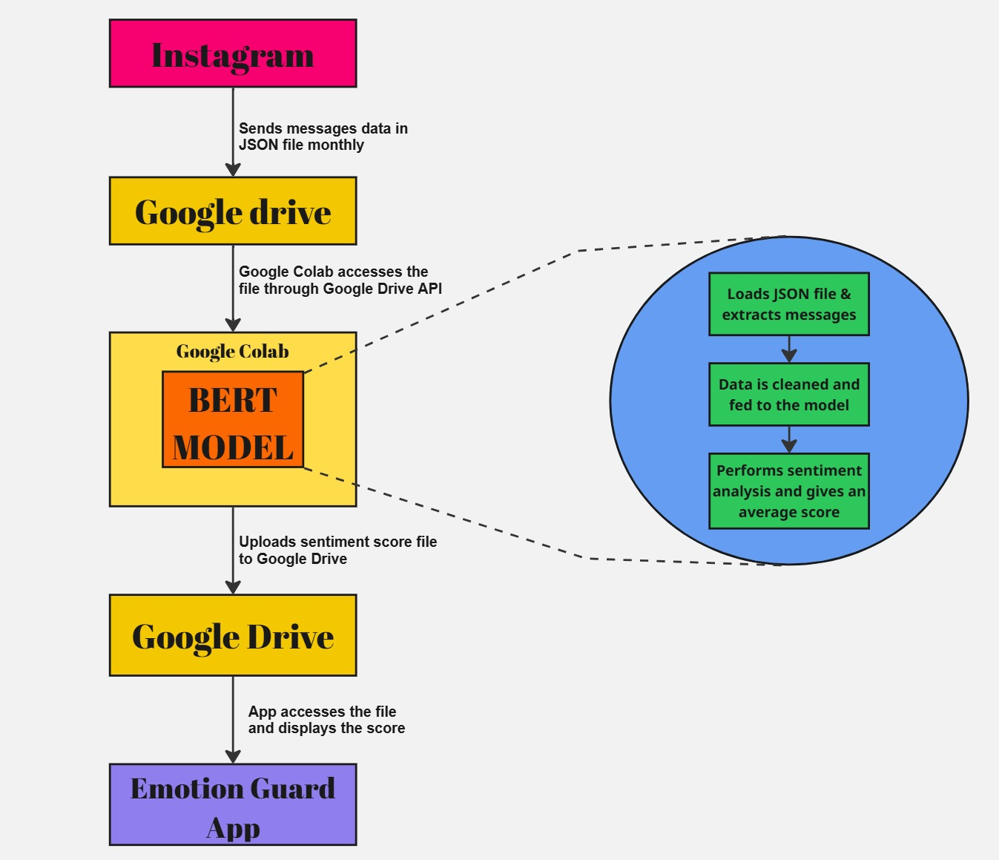

# Emotion Guard 💙

A Flutter-based app designed for child sentiment analysis using BERT and Google Drive integration.

## ⚙️ Architectural Flow

## 🚀 Features
- Weekly Mood Bar Chart 📊
- Day-wise Mood Overview 📅
- Parental Settings ⚙️
- Google Drive API for storage ☁️

## 🧰 Tech Stack
- Flutter & Dart
- Google Drive API
- BERT-based Sentiment Analysis
- FL Chart for graphs
- Project IDX

## 📱 Screens
- Login
- Dashboard
- Alerts & Settings

## 🏁 Getting Started
1. Clone this repo
2. Run `flutter pub get`
3. Launch with `flutter run`

## 👨‍💻 Developed for Google Hackathon 2025

